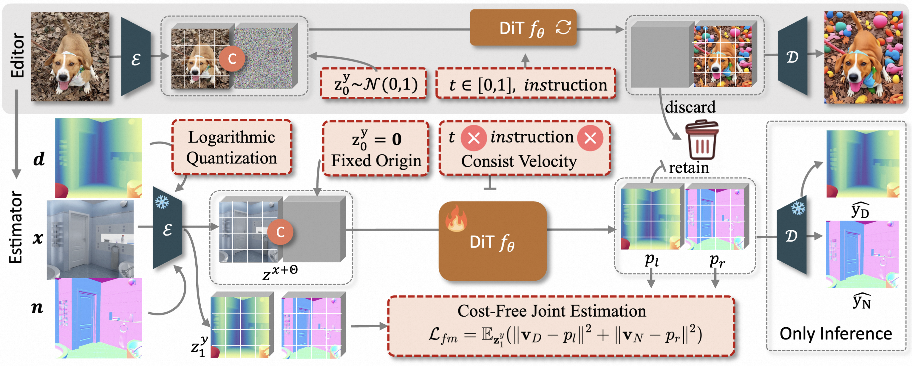

# FE2E: From Editor to Dense Geometry Estimator

[](https://amap-ml.github.io/FE2E/)
[](https://arxiv.org/abs/2509.04338)
[](https://github.com/AMAP-ML/FE2E)
[](https://huggingface.co/exander/FE2E)
[](https://www.bilibili.com/video/BV1zYXdBXE2x)
[](https://youtu.be/fyXwwH_-o5w)

[Jiyuan Wang](https://wangjiyuan9.github.io/)<sup>1,2</sup>,
[Chunyu Lin](https://scholar.google.com/citations?hl=zh-CN&user=t8xkhscAAAAJ)<sup>1&#9993;</sup>,
[Lei Sun](https://scholar.google.com/citations?user=your-id)<sup>2&#10013;</sup>,
[Rongying Liu](https://scholar.google.com/citations?user=your-id)<sup>1</sup>,
[Mingxing Li](https://scholar.google.com/citations?user=-pfkprkAAAAJ&hl=zh-CN&oi=ao)<sup>2</sup>,
[Lang Nie](https://scholar.google.com/citations?hl=zh-CN&user=vo__egkAAAAJ)<sup>3</sup>,
[Kang Liao](https://kangliao929.github.io/)<sup>4</sup>,
[Xiangxiang Chu](https://cxxgtxy.github.io/)<sup>2</sup>,
[Yao Zhao](https://faculty.bjtu.edu.cn/5900/)<sup>1</sup>

<span class="author-block"><sup>1</sup>Beijing Jiaotong University</span>  
<span class="author-block"><sup>2</sup>Alibaba Group</span>  
<span class="author-block"><sup>3</sup>Chongqing University of Posts and Telecommunications</span>  
<span class="author-block"><sup>4</sup>Nanyang Technological University</span>  
<span class="author-block"><sup>&#9993;</sup>Corresponding author. <sup>&#10013;</sup>Project leader.</span>


We present **FE2E**, a DiT-based foundation model for monocular dense geometry prediction. FE2E adapts an advanced image editing model to dense geometry tasks and achieves strong zero-shot performance on both monocular depth and normal estimation.



## 📢 News
- **[2026-03-17]**: Code and Checkpoint are available now!
- **[2026-02-21]**: FE2E was accepted by CVPR 2026!!! 🎉🎉🎉
- **[2025-09-05]**: Paper released on [arXiv](https://arxiv.org/abs/2509.04338).

---

## 🛠️ Setup

This codebase is prepared as an inference/evaluation release.

```bash
pip install -r requirements.txt
```

Recommended local layout:

```text
FE2E/
├── pretrain/
│   ├── step1x-edit-i1258.safetensors
│   ├── step1x-edit-v1p1-official.safetensors
│   └── vae.safetensors
├── lora/
│   └── LDRN.safetensors
├── infer/
│   ├── eth3d/
│   │   └── eth3d.tar
│   └── dsine_eval/
│       ├── nyuv2/
│       └── scannet/
└── logs/
```

---

## 🔥 Training

```text
[ ] Training code will be released later.
```

---

## 🕹️ Inference

### 1. Prepare Model Weights

1.  Download the base weights, which from the official [Step1X-Edit](https://github.com/stepfun-ai/Step1X-Edit) release.
2.  Download FE2E LoRA [checkpoint](https://huggingface.co/exander/FE2E/blob/main/LDRN.safetensors)


### 2. Prepare Benchmark Datasets

- Depth benchmarks follow the external evaluation data convention from [Marigold](https://github.com/prs-eth/Marigold).
- Normal benchmarks follow the external evaluation data convention from [DSINE](https://github.com/baegwangbin/DSINE).


Supported depth benchmarks:
- `nyu_v2`,`kitti`,`eth3d`,`diode`,`scannet`

Supported normal benchmarks:
- `nyuv2`,`scannet`,`ibims`,`sintel`


### 3. Run Evaluation

`[dataset] normal`:

```bash
CUDA_VISIBLE_DEVICES=0,1,2,3,4,5,6,7 \
MASTER_PORT=21258 \
PYTHONUNBUFFERED=1 \
python -u evaluation.py \
  --model_path ./pretrain \
  --eval_data_root ./infer \
  --output_dir ./infer/eval_verify_scannet_normal_8gpu \
  --num_gpus 8 \
  --num_samples -1 \
  --lora ./lora/LDRN.safetensors \
  --single_denoise \
  --prompt_type empty \
  --norm_type ln \
  --task_name normal \
  --normal_eval_datasets [dataset]
```

`[dataset] depth`:

```bash
CUDA_VISIBLE_DEVICES=0,1,2,3,4,5,6,7 \
MASTER_PORT=21257 \
PYTHONUNBUFFERED=1 \
python -u evaluation.py \
  --model_path ./pretrain \
  --eval_data_root ./infer \
  --output_dir ./infer/eval_verify_eth3d_8gpu \
  --num_gpus 8 \
  --num_samples -1 \
  --lora ./lora/LDRN.safetensors \
  --single_denoise \
  --prompt_type empty \
  --norm_type ln \
  --task_name depth \
  --depth_eval_datasets [dataset]
```


### 4. Reference Logs
If you want to known the successful status, this repo includes run logs in `logs/`:
- `logs/verify_scannet_normal_8gpu_20260317_171345.log`
- `logs/verify_eth3d_8gpu_20260317_172004.log`


---

## 🎓 Citation

If you find our work useful, please cite:

```bibtex
@article{wang2025editor,
  title={From Editor to Dense Geometry Estimator},
  author={Wang, JiYuan and Lin, Chunyu and Sun, Lei and Liu, Rongying and Nie, Lang and Li, Mingxing and Liao, Kang and Chu, Xiangxiang and Zhao, Yao},
  journal={arXiv preprint arXiv:2509.04338},
  year={2025}
}
```
